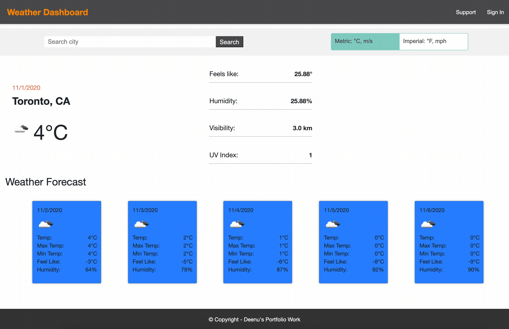

# UofT-weather-app
A weather dashboard web application with search functionality to find current weather conditions and the future weather outlook for multiple cities. The weather dashboard app will run in the browser and feature dynamically updated HTML and CSS powered by jQuery.

Hosted Url: https://deenuy.github.io/UofT-weather-app/

## User Story
As a user
I want to see the weather outlook for multiple cities
so that I can plan a trip accordingly

## Technology stack
* HTML5, CSS
* Javascript (jQuery, moment js, AJAX, browser storage)

## Demo
